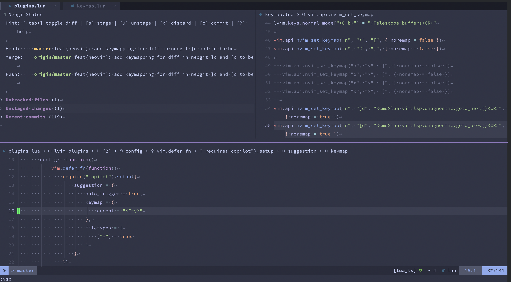

# Configuration

Here is the list of dotfiles I use.

⚠️  Don't use it without taking a look to what's inside.
To install, run `install.sh`. It will create symlinks to the right files.

(I keep my original .vimrc as nvim.old, since I used it since school)

## Neovim

Install xclip in order to make the '+' register to work
```
sudo apt install xclip
```

install ag:
```
brew install the_silver_searcher
```

Iterm2:
Settings > Profile > Keys > Keys mapping > (+) > Action: Send text with vim, and then configure

Option k to send\<M-k> and Option j to send \<M-j>


