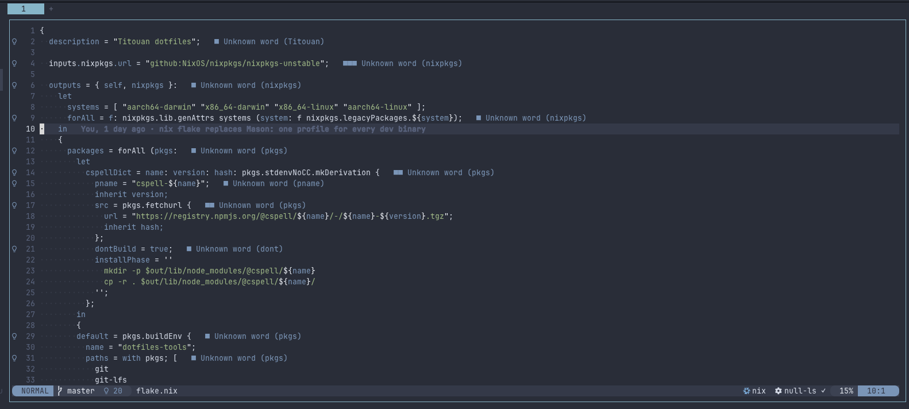

# Configuration

Here is the list of the dotfiles I use.

(I keep my original .vimrc and stuff into archive)

## Binaries
I use nix to manage the binaries I use cross projects:

To install:

```
nix profile add ~/Code/dotfiles      # install everything
nix flake update                     # bump nixpkgs
nix profile upgrade dotfiles         # rebuild the bundle
```

I use it to install my lsp servers instead of Mason.

## Dotfiles


### Nerd font

`nerd-fonts.jetbrains-mono` is in the nix profile, but macOS only scans
`~/Library/Fonts`, so the files have to be linked there:

```bash
if [ "$(uname)" = "Darwin" ]; then
  mkdir -p "$HOME/Library/Fonts"
  ln -sf "$HOME/.nix-profile/share/fonts/truetype/NerdFonts/JetBrainsMono/"*.ttf "$HOME/Library/Fonts/"
fi
```

On Linux fontconfig finds `~/.nix-profile/share/fonts` on its own.

### zsh

```bash
ln -sf $PWD/zsh/zshrc $HOME/.zshrc
```

No oh-my-zsh. Completions, fzf and autojump come from the nix profile;
starship is the prompt.

### git

```bash
ln -sf $PWD/git/gitconfig $HOME/.gitconfig
```

Aliases: `co`, `up` (pull --rebase --autostash), `graph`. LFS filters,
`fetch.prune`, `push.autoSetupRemote`.

### Neovim

```bash
ln -s $PWD/nvim-kickstart ~/.config/nvim-kickstart
NVIM_APPNAME=nvim-kickstart nvim
```

### herdr

```bash
mkdir -p $HOME/.config/herdr
ln -sf $PWD/herdr/config.toml $HOME/.config/herdr/config.toml
herdr plugin install paulbkim-dev/vim-herdr-navigation --yes
```


### Claude Code skills


## Screenshot


